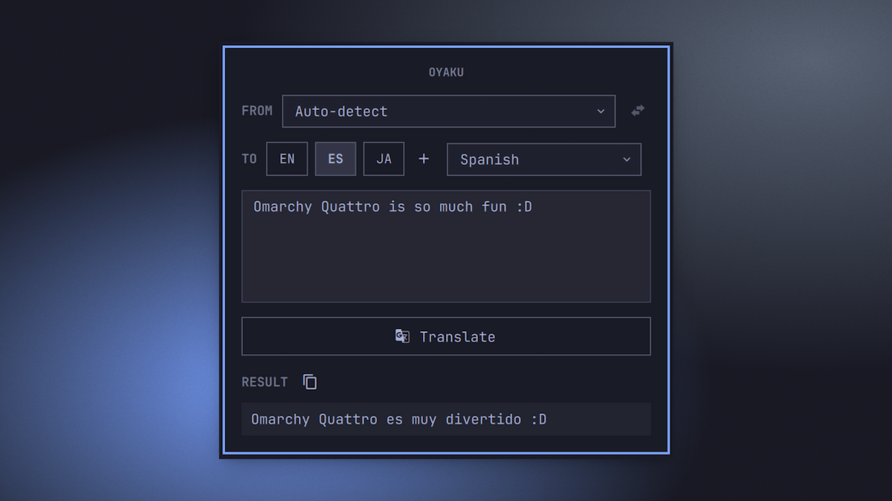

# Oyaku

A lightweight translate widget for the Omarchy Quattro bar. Click the bar icon to open a small panel, type or paste text, pick a source and target language, and get a translation from [translate-shell](https://github.com/soimort/translate-shell) (`trans`) without leaving the bar.



## Prerequisites

Oyaku shells out to `trans`, so **translate-shell must be installed**:

```sh
sudo pacman -S translate-shell
```

The AUR `-git` variant works too.

## Install

```sh
omarchy plugin add https://github.com/ussego/oyaku.git --enable
```

The widget appears in the right section of the bar by default. Move it if you prefer:

```sh
omarchy bar move ussego.oyaku --section center
```

## Usage

- **Left click** the bar button to open or close the panel.
- Type or paste the text you want to translate in the source box.
- Pick source and target languages from the searchable dropdowns (type to filter), or use the quick-target buttons.
- **Right-click** a quick-target button to remove it. Click the **+** button to add a new quick target.
- Press **Enter** (or click **Translate**) to translate. **Shift+Enter** inserts a newline.
- Click the swap button to exchange source and target (only when source is not `auto`).
- Click the copy button to copy the result to the clipboard.
- Press **Escape** to close the panel, or **Tab** to switch to the neighboring panel.

## Quick-language list

The quick-target buttons are stored in your `~/.config/omarchy/shell.json` entry for Oyaku. The default buttons are **EN**, **ES**, and **JA**. You can edit them from the panel:

- Click the **+** button next to the quick targets and pick a language to add a button.
- **Right-click** an existing quick-target button to remove it.

Or edit them directly in `shell.json`, for example:

```json
{
  "id": "ussego.oyaku",
  "targets": ["en", "es", "ja", "de"],
  "target": "de"
}
```

`targets` controls the quick buttons (maximum **4**); `target` is the last-used target language. Any language code supported by `trans` works.

## IPC

Oyaku exposes `omarchy-shell` IPC targets under `ussego.oyaku`, so you can bind hotkeys or scripts to it:

```sh
omarchy-shell ussego.oyaku open       # open the panel
omarchy-shell ussego.oyaku close      # close the panel
omarchy-shell ussego.oyaku show       # alias for open
omarchy-shell ussego.oyaku hide       # alias for close
omarchy-shell ussego.oyaku toggle     # toggle the panel
omarchy-shell ussego.oyaku paste      # open and paste the clipboard text
omarchy-shell ussego.oyaku translate  # open, paste clipboard, and translate
```

For example, add to `~/.config/hypr/bindings.lua`:

```lua
hl.unbind("SUPER + SHIFT + T")
o.bind("SUPER + SHIFT + T", "Open oyaku", "omarchy-shell ussego.oyaku toggle")
o.bind("SUPER + CTRL + T", "Translate clipboard", "omarchy-shell ussego.oyaku translate")
```

## Remove

```sh
omarchy plugin remove ussego.oyaku
```

## License

MIT — see [LICENSE](LICENSE).
